<p align="center">
  
</p>

<h1 align="center">Vibe Trade</h1>

<p align="center">
  <strong>Describe a crypto trading strategy in plain English. Get professional backtesting in seconds.</strong>
</p>

<p align="center">
  <a href="https://vibe-trade-lime.vercel.app">Live Demo</a>&nbsp;&nbsp;|&nbsp;&nbsp;<a href="#architecture">Architecture</a>&nbsp;&nbsp;|&nbsp;&nbsp;<a href="#from-would-it-have-worked-to-run-it-live">The Engine</a>&nbsp;&nbsp;|&nbsp;&nbsp;<a href="#getting-started">Get Started</a>
</p>

---

> **"Buy BTC when RSI drops below 30, sell when it goes above 70"**
>
> That sentence becomes a Zod-validated rule schema, backtested against 6 years of daily data, with 15 performance metrics, trade-by-trade audit trail, and candlestick charts — in under 2 seconds. No coding required.

---

<p align="center">
  
</p>

## The Core Idea

Most "AI trading" tools let AI make decisions. That's the wrong architecture.

**Vibe Trade separates the intelligence from the execution:**

```mermaid
flowchart TD
    A["💬 'Buy when RSI < 30, sell above 70'"] --> B
    B["🤖 AI Parser — Claude API<br/>(single network call)"] --> C
    C["🔒 Zod Validation + Invariants<br/>(trust boundary)"] --> D
    D["⚙️ Backtest Engine<br/>Pure functions · Deterministic · Zero AI<br/>Same input = same output, every time"]

    style A fill:#1a1a2e,stroke:#22c55e,color:#fff
    style B fill:#1a1a2e,stroke:#f59e0b,color:#fff
    style C fill:#1a1a2e,stroke:#ef4444,color:#fff
    style D fill:#1a1a2e,stroke:#22c55e,color:#fff,stroke-width:3px
```



**AI is the translator, not the engine.** After parsing, there are zero AI calls. No hallucinations in the math. No randomness. No network dependencies. The engine runs entirely in your browser.

This isn't just a design choice — it's the architecture that makes everything else possible.

## From "Would It Have Worked?" to "Run It Live"

Today, Vibe Trade answers **"what would've happened?"** — but the architecture is built for what comes next.

The engine doesn't know it's running a backtest. It consumes a validated JSON rule schema and executes it against price data. That's it. Swap historical candles for a live WebSocket feed, and the same engine — same rules, same schema, zero code changes — becomes a **live trading bot**.

> **Describe a strategy → AI compiles it to validated rules → Engine executes trades.**
>
> Backtesting is step one. Automated execution is the same pipeline with a different data source.

The road from here:

- **Live execution** — connect to an exchange API, feed real-time prices, same engine places real orders
- **Strategy alerts** — evaluate rules on every tick, push notifications when signals fire
- **Multi-asset screening** — run one strategy across hundreds of pairs in parallel
- **Strategy marketplace** — share, fork, and remix validated rule schemas between traders

**The backtest demo is the proof of concept. The engine is the product.**

## What You Get

### Describe strategies naturally
Type or speak a strategy in plain English. AI parses it into structured, validated rules. Review the rules as readable cards or raw JSON before running.

### Professional backtesting
- **Candlestick chart** with trade markers (entry/exit arrows on every trade)
- **Equity curve** vs buy-and-hold benchmark, drawn on the same chart
- **15 performance metrics** — Sharpe, Sortino, max drawdown, win rate, profit factor, and more
- **Full trade log** — every entry, exit, P&L, and holding period

<p align="center">
  
  <br />
  <em>Candlestick chart with buy/sell markers at exact prices. Trade-by-trade log with P&L, holding days, and exit reason.</em>
</p>

<p align="center">
  
  <br />
  <em>Equity curve + drawdown analysis with synced tooltips. Strategy (green) vs Buy & Hold (dashed).</em>
</p>

### Honest methodology
- **Anti-lookahead execution**: signal evaluated on `close[i]`, execution at `open[i+1]`
- **Fees + slippage modeled**: 10 bps fee + 5 bps slippage on every trade
- **Benchmark uses identical assumptions** — no tricks to make the strategy look good
- **Audit panel** shows every assumption, visible in the UI

### Compare strategies head-to-head
Run any two strategies side by side. Overlaid equity curves. Metric-by-metric comparison with delta arrows showing exactly where one wins and the other doesn't. One-click presets: "vs Weekly DCA", "vs Golden Cross", "vs MACD Momentum".

### Instant asset swap
Click a different asset — BTC, ETH, SOL, BNB, XRP, DOGE, ADA, AVAX — and both strategies re-run **instantly**. No spinner. No network call. Pure client-side math.

### Built to impress
- **4 color themes** (Terminal Green, Amber, Cyan, Copper) — switch instantly
- **Animated candlestick particle background** with dynamic lighting
- **Custom loading spinner** — candlestick bars with scanning laser effect
- **NumberFlow** animated metrics (staggered counting-up transitions)
- **Voice input** — speak your strategy using the Web Speech API
- **Run history** — click to restore any previous result
- **Share via URL** — encode any result as a shareable link
- **Export** — CSV trade log or full JSON result

## By the Numbers

| | |
|---|---|
| **203** | unit tests across 14 test files |
| **8** | crypto assets with daily OHLCV data (2020–2025) |
| **15** | performance metrics per backtest |
| **7** | indicator families (SMA, EMA, RSI, MACD, BB, ATR, %Change) |
| **2** | strategy modes (signal-based + DCA) |
| **0** | runtime dependencies for compute — engine is pure TypeScript |

## Tech Stack

| Layer | Technology |
|-------|-----------|
| Framework | Next.js 16 (App Router, TypeScript strict) |
| Styling | Tailwind CSS v4 + shadcn/ui |
| Candlestick chart | TradingView lightweight-charts v5 |
| Analytics charts | Recharts v3 |
| AI parser | Claude API (Sonnet) — single network call |
| Validation | Zod v4 (runtime schema + invariant validation) |
| Voice input | Web Speech API (browser-native, zero packages) |
| Testing | Vitest |
| Package manager | pnpm |
| Deploy | Vercel |

## Architecture

```
src/
├── app/            # Next.js App Router — page, layout, API route
│   └── api/parse/  # POST: prompt + asset → Claude → Zod-validated RuleSet
├── components/     # React UI — input, confirmation, dashboard, charts, comparison
├── engine/         # Backtest engine — standard + DCA modes, evaluator, benchmark
├── indicators/     # Pure functions: SMA, EMA, RSI, MACD, Bollinger, ATR, %Change
├── metrics/        # Performance calculator (15 metrics)
├── types/          # Zod schemas + inferred TypeScript types
├── data/           # Presets, snapshots, data loader
└── lib/            # AI parser, export, formatting, theme
```

**Dependency flow:** `types → indicators → engine → metrics → UI`

No circular dependencies. Every engine function is pure — same inputs produce identical outputs, every time.

## Testing

203 unit tests verify every layer:

- **Indicators** — hand-calculated expected values for all 7 families
- **Condition evaluator** — 53 tests including cross detection
- **Backtest engine** — standard mode, DCA mode, no-lookahead verification
- **Metrics calculator** — 31 tests including edge cases
- **Schema validation** — 19 tests for Zod parsing + invariant checks

```bash
pnpm test           # Run all 203 tests
pnpm test:watch     # Watch mode
```

## Getting Started

### Prerequisites

- Node.js 18+
- pnpm

### Setup

```bash
git clone https://github.com/oziniak/vibe_trade.git
cd vibe_trade
pnpm install
```

### Environment

Create `.env.local`:

```
ANTHROPIC_API_KEY=your-api-key-here
```

Only needed for local development with AI parsing. The [live demo](https://vibe-trade-lime.vercel.app) is fully functional — rate-limited to protect API costs, but ready to use.

### Run

```bash
pnpm dev        # Development server
pnpm build      # Production build
pnpm test       # Run all tests
```

## Try It Now

The [live demo](https://vibe-trade-lime.vercel.app) is fully functional with rate-limited AI parsing. Type any strategy and run it.

Want to explore without limits? Vibe Trade ships with **6 preset strategies** and **4 quick demos** that bypass AI entirely — validated rule schemas fed straight to the engine. Full backtesting, full charts, full metrics. No API key needed, no network calls, works completely offline.

---

<p align="center">
  <strong>One week. One developer. <a href="https://claude.ai/claude-code">Claude Code</a>.</strong>
</p>

<p align="center">
  Built for the <a href="https://xbo.com">XBO Claude Code Challenge</a> (Feb 20–27, 2026)
</p>
